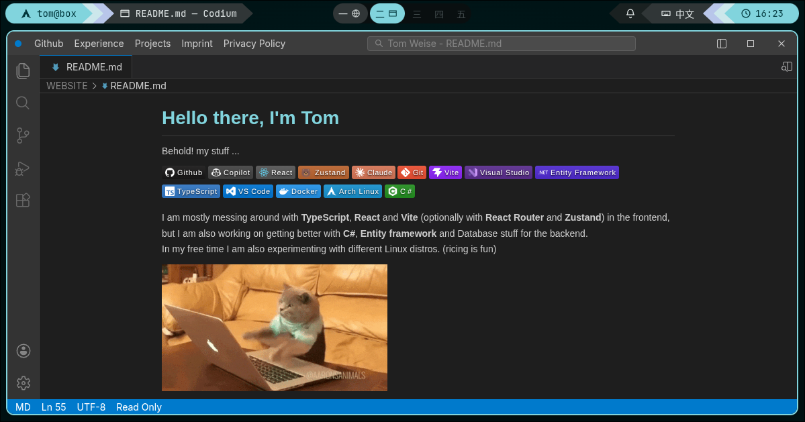

[](https://tomweise.dev)

# homepage

My personal site, live at **[tomweise.dev](https://tomweise.dev)**: an Arch Linux + Hyprland desktop in the browser, modelled on my own rice. Projects, work experience and skills are files in a folder, and you browse them with the apps I actually use.

It started as a fork of [vscode_website](https://tonix401.github.io/vscode_website/), a read-only VSCode-style file viewer, and grew a window manager around it.

## What's on the desktop

- **Waybar** — workspace pills with an icon per open window, the focused window's title, and cpu/memory modules that measure the tab itself
- **niri-style window strip** — one window fills the screen, more scroll sideways; focus follows the mouse, and any window can be maximized
- **Apps**, all reading the same open folder:
  - **Codium** — explorer, tabs, Shiki highlighting, markdown/HTML preview, quick open, a source-control panel that lists this repo's own commits, and Run and Debug, which docks [Eruda](https://github.com/liriliri/eruda), an in-page DevTools, on the right
  - **Chromium** — the files as pages, with the folder as a bookmarks bar
  - **jīzǐ** — a yazi-style terminal file manager in a kitty window
  - **Obsidian** — the folder as a vault, with a graph view
  - **btop** — the desktop's windows as a process tree under systemd and Hyprland
  - **fastfetch** — the visitor's own browser, in my fastfetch layout
- **Launcher** — opens apps and picks one of five matugen-generated themes and four wallpapers
- **Nothing in the URL** — the whole layout lives in `sessionStorage`, so a reload restores it and a new tab starts fresh; the theme is kept in `localStorage`

## Content

Everything the apps show is in [`open_folder/`](./open_folder). A Vite plugin reads it at build time and bundles it into a virtual module, so the output is a fully static site with no runtime file I/O. A `10#` style prefix sets the sort order and is hidden in the explorer.

Titles, bookmarks, sidebar activities and the SEO metadata (description, Open Graph, JSON-LD) are configured in [`vscode_website.config.ts`](./vscode_website.config.ts). The build also prerenders the markdown into the HTML for crawlers and emits `robots.txt` and `sitemap.xml`.

## Getting started

```bash
npm install
npm run dev        # dev server on port 8080
npm test           # Vitest
npm run lint       # ESLint
npm run build      # type-check + production build
npm run preview    # serve the build locally
```

Two generated files are committed, because CI has neither tool:

```bash
npm run generate:themes   # src/themes/palettes.ts, needs matugen
npm run generate:og       # public/og-image.png, needs chromium
```

Pushing to `main` runs the tests, builds, and deploys to GitHub Pages; the custom domain comes from `public/CNAME`.

## Stack

- React 19
- TypeScript
- Vite 8
- Shiki (syntax highlighting)
- react-markdown
- Vitest

## License

The **code** is [MIT](./LICENSE): use it for your own site, as long as you keep
the copyright notice. A link back to [tomweise.dev](https://tomweise.dev) or
this repository in your README or footer is appreciated.

The **content** — everything in `open_folder/` and `activities/`, the images
and videos in `public/`, and the personal details in the site config — is
© Tom Weise, all rights reserved, and not covered by the MIT license. See
[`CONTENT-LICENSE.md`](./CONTENT-LICENSE.md). If you fork this for your own
site, swap in your own content.
